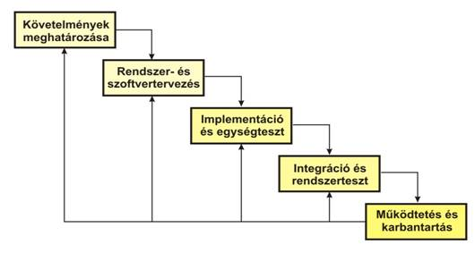
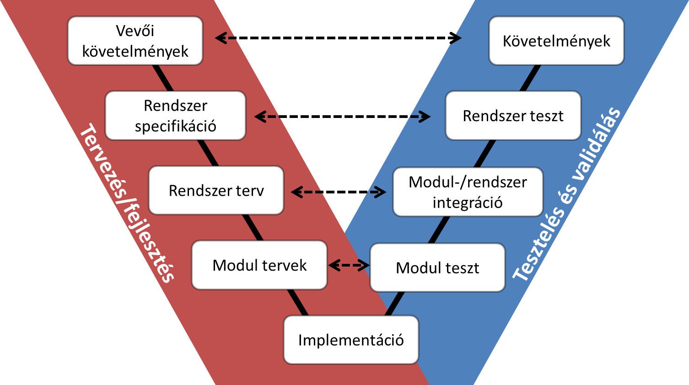
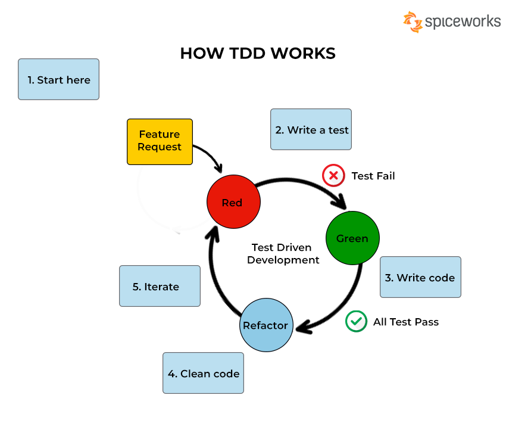
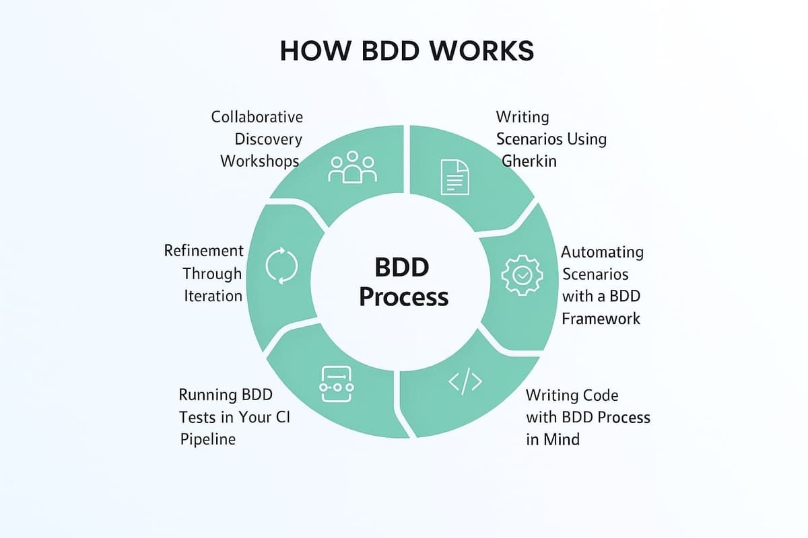

# Tesztautomatizálási kérdések

## Tesztelési alapok (ISTQB-hez kapcsolódó)

## A tesztelés alapjai:
#### Mi a tesztelés célja? Mi nem az?
A tesztelés célja nem az, hogy bebizonyítsa, hogy a rendszer hibátlan, hanem hogy feltárja a hibákat a lehető leghamarabb, ezáltal csökkentve a javítás költségeit.
#### Mi a kapcsolat a tesztelés és a hibamegelőzés között?
A tesztelés nemcsak a hibák megtalálását, hanem azok megelőzését is szolgálja. A hibák elemzése segít javítani a folyamatokat, így a jövőben kevesebb hiba keletkezik.
#### Miért fontos, hogy a tesztelők függetlenek legyenek a fejlesztőktől?
A független tesztelő objektívebben látja a rendszert.
Nem befolyásolja az a tény, hogy ő maga írta a kódot.
Könnyebben észreveszi azokat a hibákat, amiket a fejlesztő már „megszokott”.
#### Mi a veszélye annak, ha a fejlesztő maga teszteli a saját kódját?
A fejlesztő hajlamos elnézni a saját hibáit, mert ismeri a kódot, és inkább a helyes működést próbálja igazolni, nem pedig hibát keresni.
#### Mik a tesztelési alapelvek?
1. A tesztelés hibák jelenlétét mutatja ki.
2. A kimerítő tesztelés lehetetlen.
3. A tesztelést a fejlesztés korai szakaszában kell kezdeni.
4. A hibák halmozódnak.
5. Peszticid paradoxon – a tesztek frissítés nélkül elvesztik hatékonyságukat.
6. A tesztelés kontextustól függ.
7. A hibák hiánya nem jelenti a rendszer helyességét.

#### Mit jelent az „alapvető tesztelési elv”, hogy „a kimerítő tesztelés lehetetlen”?
Ez azt jelenti, hogy nem lehet minden lehetséges bemenetet és feltételt letesztelni, mert ezek száma túl nagy. Ezért a tesztelés mindig csak a legfontosabb esetekre korlátozódik.
#### Mit jelent az „alapvető tesztelési elv”, hogy „a hibák halmozódnak”?
Ez azt jelenti, hogy a hibák nem egyenletesen oszlanak el a rendszerben, hanem gyakran bizonyos részeken gyűlnek össze, ahol a kód bonyolultabb vagy nehezebben kezelhető.
#### Mit jelent az „alapvető tesztelési elv”, hogy „a tesztelés a kontextustól függ”?
Ez azt jelenti, hogy a tesztelési módszerek és eszközök kiválasztása mindig a konkrét rendszer típusától és céljától függ. Más tesztelési megközelítés kell például egy játékhoz, mint egy banki alkalmazáshoz.

## 2. Tesztelés a szoftverfejlesztés életciklusán át
#### Mik a tesztszintek, és mi a különbség köztük?
Egységteszt (Unit test): Kisebb kódrészletek (függvények, osztályok) tesztelése.
Integrációs teszt: A komponensek együttműködését ellenőrzi.
Rendszerteszt: Az egész rendszert egyben vizsgálja.
Felhasználói elfogadási teszt (UAT): Ellenőrzi, hogy a rendszer megfelel-e az üzleti igényeknek.
#### Miért nem érdemes mindig ugyanazokat a teszteseteket futtatni (regressziós torzítás)?
Ha mindig ugyanazokat a teszteket futtatjuk, új hibák rejtve maradnak – a tesztkészlet „elavul”.
Ez a peszticid paradoxon is: a tesztelés hatékonysága csökken, ha nem frissítjük a teszteseteket.
#### Mi az egységtesztelés (unit testing)? Ki felelős az egységtesztek írásáért?
Az egységteszt a legkisebb programrészek (függvények, metódusok) automatikus tesztelése.
A fejlesztők írják és futtatják.
Cél: minél hamarabb kiszűrni a hibákat a kódban.
#### Mi a különbség a verifikáció és a validáció között?
Verifikáció: „Jól építjük?” – megfelel-e a rendszer a specifikációnak.
Validáció: „A jót építjük?” – megfelel-e a rendszer a felhasználói igényeknek.
#### Mik a tesztelési típusok, és mi a különbség köztük?
Funkcionális teszt: A rendszer funkcióit ellenőrzi, vagyis azt, hogy a szoftver az elvárt módon viselkedik a bemenetekre.
Nem funkcionális teszt: A rendszer egyéb tulajdonságait (például teljesítmény, biztonság, megbízhatóság, használhatóság) vizsgálja.
Regressziós teszt: Ellenőrzi, hogy a módosítások vagy hibajavítások nem okoztak-e új hibákat a már működő funkciókban.
Smoke teszt: Gyors, alapvető ellenőrzés annak megállapítására, hogy a rendszer alapvetően működőképes-e, és érdemes-e tovább tesztelni.
#### Mi a különbség a fehér doboz, szürke doboz és fekete doboz tesztelés között?
Fehér doboz tesztelés: A tesztelő ismeri a kód belső működését, és ennek alapján teszteli a vezérlési és adatfolyamatokat.
Fekete doboz tesztelés: A tesztelő nem ismeri a belső kódot, csak a bemeneteket és kimeneteket vizsgálja.
Szürke doboz tesztelés: A tesztelő részben ismeri a belső működést, de a tesztelés a felhasználói szinthez közel történik.
#### Mi a különbség a felhasználói elfogadási teszt (UAT) és a rendszerteszt között?
Rendszerteszt: azt vizsgálja, hogy a teljes rendszer megfelel-e a műszaki követelményeknek.

Felhasználói elfogadási teszt (UAT): azt ellenőrzi, hogy a rendszer megfelel-e a felhasználók igényeinek és elfogadható-e számukra használat közben.
#### Mi a különbség a statikus és dinamikus tesztelés között?
Statikus tesztelés: a programot futtatás nélkül vizsgálják (például kódellenőrzés, dokumentáció átnézése).

Dinamikus tesztelés: a programot futtatják, és megfigyelik, hogyan viselkedik különböző bemenetekre.
### Szoftverfejlesztési és tesztelési modellek(vízesés, V-modell, agilis modell):

### TDD, BDD modell jellemzői.
 
